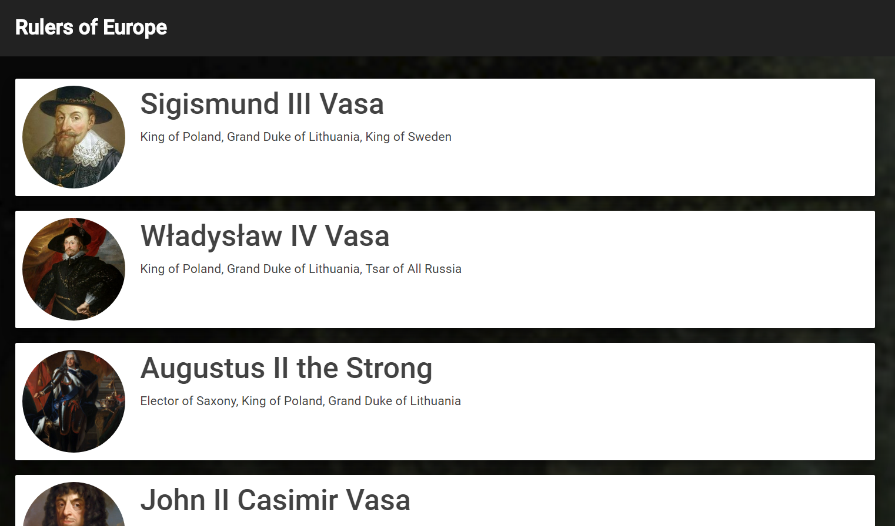

# A React App That Shows a List of Kings and a Short Description for Each of Them




 
## [cubbic.github.io/KingsEurope/dist/](https://cubbic.github.io/KingsEurope/dist/)

## Install

```
git clone https://github.com/cubbic/KingsEurope.git`
cd KingsEurope
npm install
npm install -g live-server // webpack-dev-server is not configured here yet :(
npm start // to start webpack
npm run server // to start live-server
```
